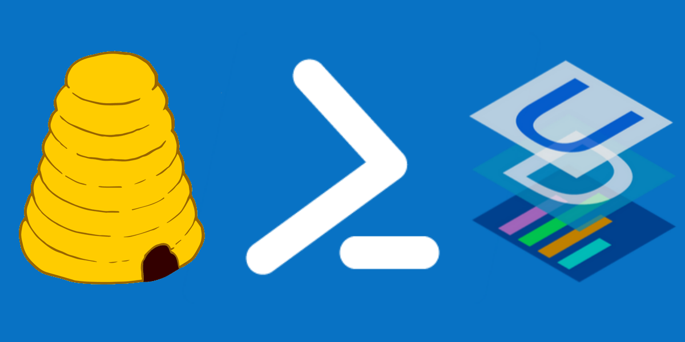
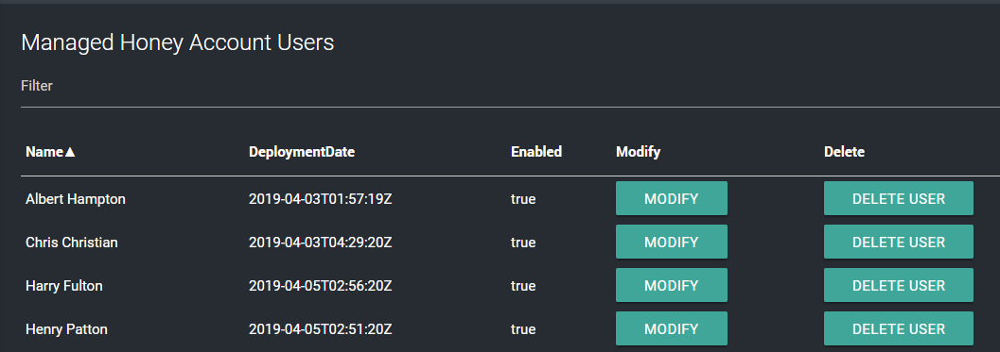
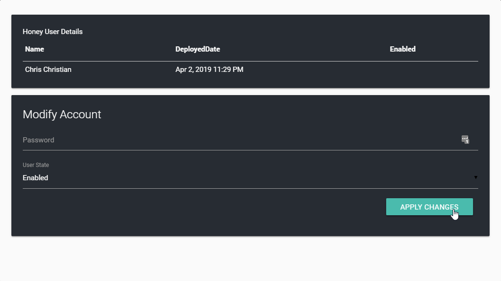
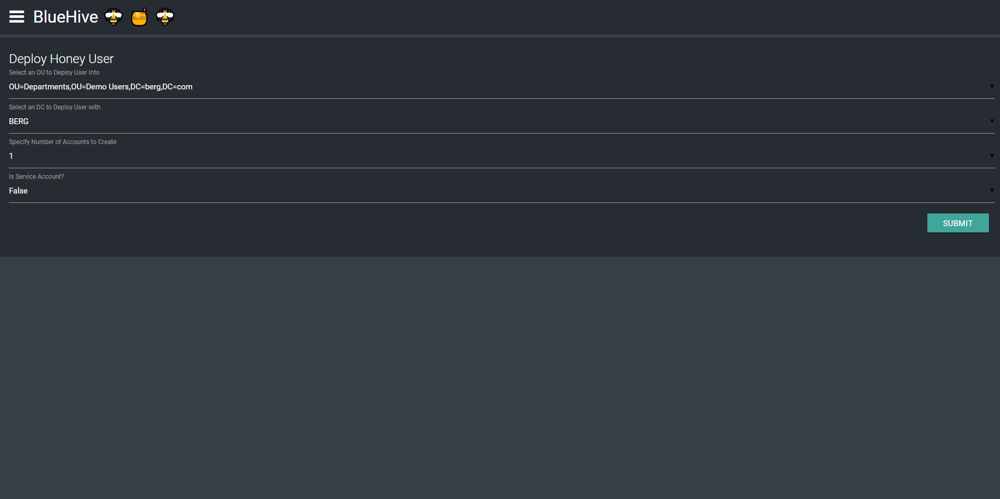

# BlueHive



BlueHive is HoneyPot User management tool built with the free open source community edition of [Universal Dashboard](https://universaldashboard.io/) by [Ironman Software](https://ironmansoftware.com). This utility can be used to create and manage Honeypot user and service accounts via an interactive web dashboard.

**WARNING**: This project is intended to be used as a teaching tool for learning [Universal Dashboard](https://universaldashboard.io/) and the basic concepts of Active Directory Honey Pot Users - don't use this in your production :) 🖥 🔥 

## Screenshots

**Home Page**


**Management Page**


**Modify Honey Account**


**Creating Honey Accounts**



## Features
* Create "Honey Pot" Users with randomized names / properties
  * Users
  * Service Accounts (with SPN)
* Target creation of an account on a specific domain / controller
* **Dashboards** showing status of deployed HoneyPot users
* Management of Honey Pot User (Add/Remove/Modify)
* Track History of Honey User Deployments
* One Click to Remove Honey Users from Active Directory

## Drawbacks / Issues
* Service Accounts will be **BUSTED** by [HoneyPot Buster](https://github.com/JavelinNetworks/HoneypotBuster) - I have not yet implemented a good way to update values like "lastlogontimestamp" to reduce the Fank Rank
* Data storage via json files on disk 🤷
* Only "half-way" supports multiple domains, needs some data management work needs to be completed
* "OtherName" of created token objects have value of 1337 - this is the identifier for a honey object used by this. Ideally accounts would be independently tracked outside of such a value.
* Many more values in the Ad Objects COULD be populated but are not.
* Some... LESS THAN efficient powershell scripting ;)

## Usage
1. Populate your own environmental variables in the "start.ps1" and where you would like bluehive to store it's data by populating the ```$BlueHiveFolder``` variable in `HoneyData.psm1`
2. Use the start script to connect to active directory
3. Open the "Domain Connection" page and initiate a new domain sync by specifying your domain name and clicking the "Sync" button.
4. Verify Domain Information in the "Existing Domain Connection" Pane. **Note - at this point you should have domain data populated in your `Data\Retrieved\Domains` folder
5. Use Deployment Page to deploy new Honey Account
6. Use the Management Page to delete / edit Honey Accounts that have been deployed.
7. Use the dashboard pages to management honey accounts and don't forget to check out the Logs folder for a good old fashion log file.